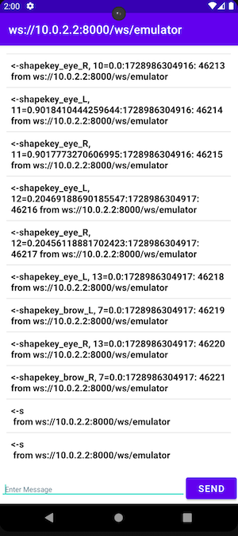

# Android WebSocket Client written in Kotlin
Web Socket Client Side For Android With Kotlin you can use this app with Ktor Server Side, Find Ktor Project Here: [Ktor WebSocket Server Side](https://github.com/kimoandroid/Ktor-WebSocketServer)

# App Preview


# Usage
add this line into your `build.gradle` app.
```gradle
dependencies {
    implementation 'org.java-websocket:Java-WebSocket:1.4.0'
}
```
## License
- [Apache License](https://www.apache.org/licenses/LICENSE-2.0)
